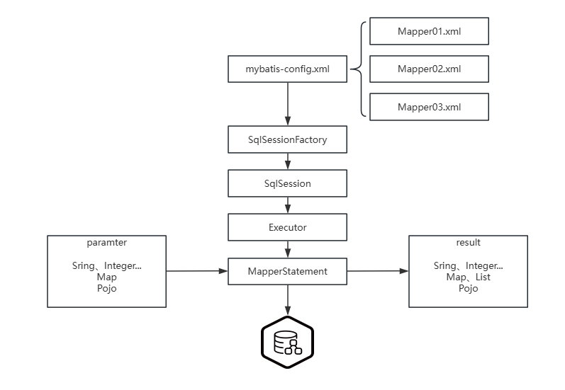
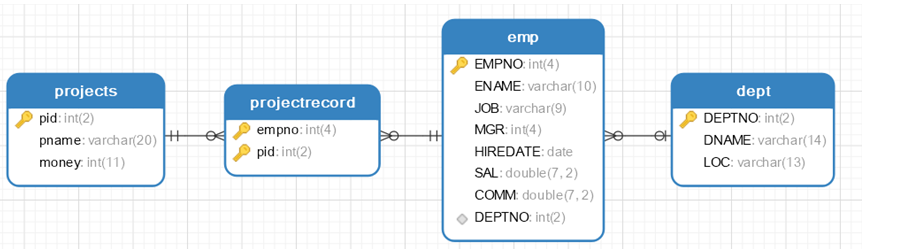
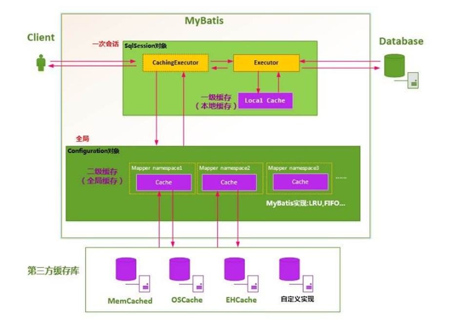

# 一、MyBatis简介

## 1.ORM

ORM（Object-Relational Mapping，对象关系映射）框架是一种在关系型数据库和对象之间进行自动化持久化数据的技术。ORM框架允许开发者用他们自己的编程语言中的对象来操作数据，而不必直接编写SQL查询语言，这极大地简化了数据操作和开发过程。

### （1）持久化

将程序数据在持久性存储（如硬盘）中保存的过程，使得数据在程序关闭后仍然存在。这通常涉及将内存中的对象状态转换为可以存储在数据库或其他存储媒介中的格式。

### （2）持久层

架构中负责数据持久化管理的部分。在多层架构中，持久层专注于数据存取和管理，与业务逻辑层和表示层（前端）分离。

## 2.MyBatis概述

MyBatis 是一个流行的==Java持久层框架==，它提供了==半自动化的ORM==功能。通过MyBatis，开发者可以==通过简单的XML或注解来配置和映射原生信息，从而实现Java对象与数据库表之间的映射==。

## 3.MyBatis简单使用

> 使用maven作为版本控制工具

### （1）依赖

```xml
<dependencies>
    <!--mysqlConnector-->
    <dependency>
      <groupId>mysql</groupId>
      <artifactId>mysql-connector-java</artifactId>
      <version>8.0.16</version>
    </dependency>
    <!--mybatis 核心jar包-->
    <dependency>
      <groupId>org.mybatis</groupId>
      <artifactId>mybatis</artifactId>
      <version>3.5.3</version>
    </dependency>
  </dependencies>
```

### （2）相关配置

#### 创建实体类

```java
@Data
@AllArgsConstructor
@NoArgsConstructor
public class Dept implements Serializable {
    private Integer deptno;
    private String dname;
    private String loc;
}
```

```java
@Data
@AllArgsConstructor
@NoArgsConstructor
public class Emp implements Serializable {
    private Integer empno;
    private String ename;
    private String job;
    private Integer mgr;
    private Date hiredate;
    private Double sal;
    private Double comm;
    private Integer deptno;
}
```

#### 创建Mapper映射文件

DeptMapper.xml

```xml
<?xml version="1.0" encoding="UTF-8" ?>
<!DOCTYPE mapper
        PUBLIC "-//mybatis.org//DTD Mapper 3.0//EN"
        "http://mybatis.org/dtd/mybatis-3-mapper.dtd">
<mapper namespace="aaa">
    <select id="findAll" resultType="dept"> <!-- Dept在sqlMapConfig.xml被扫描，需要用小写，否则需要写全路径-->
        select * from dept
    </select>
</mapper>
```

EmpMapper.xml

```xml
<?xml version="1.0" encoding="UTF-8" ?>
<!DOCTYPE mapper
        PUBLIC "-//mybatis.org//DTD Mapper 3.0//EN"
        "http://mybatis.org/dtd/mybatis-3-mapper.dtd">
<mapper namespace="aaa">
    <select id="findEmpAll" resultType="Emp">
        select * from emp
    </select>
</mapper>
```

#### 创建jdbc.properties属性文件

```properties
jdbc_driver=com.mysql.cj.jdbc.Driver
jdbc_url=jdbc:mysql://127.0.0.1:3306/mydb?useSSL=false&useUnicode=true&characterEncoding=UTF-8&serverTimezone=Asia/Shanghai
jdbc_username=root
jdbc_password=root
```

#### 创建sqlMapConfig.xml核心配置文件

```xml
<?xml version="1.0" encoding="UTF-8" ?>
<!DOCTYPE configuration
        PUBLIC "-//mybatis.org//DTD Config 3.0//EN"
        "http://mybatis.org/dtd/mybatis-3-config.dtd">
<configuration>
    <!--导入外部配置属性-->
    <properties resource="jdbc.properties"></properties>
    <!--包扫描实体类-->
    <typeAliases>
        <package name="com.lxy.pojo"/>
    </typeAliases>
    <!--配置环境信息-->
    <environments default="development">
        <environment id="development">
            <transactionManager type="JDBC"/>
            <dataSource type="POOLED">
                <property name="driver" value="${jdbc_driver}"/>
                <property name="url" value="${jdbc_url}"/>
                <property name="username" value="${jdbc_username}"/>
                <property name="password" value="${jdbc_password}"/>
            </dataSource>
        </environment>
    </environments>
    <!--加载mapper映射文件-->
    <mappers>
        <mapper resource="com/lxy/mapper/DeptMapper.xml"></mapper>
        <mapper resource="com/lxy/mapper/EmpMapper.xml"></mapper>
    </mappers>
</configuration>
```

### （3）开发业务代码

```java
public class Test01 {
    private SqlSession sqlSession;
    @Before
    public void init(){
        SqlSessionFactoryBuilder ssfb =new SqlSessionFactoryBuilder();
        InputStream resourceAsStream = null;
        try {
            resourceAsStream = Resources.getResourceAsStream("sqlMapConfig.xml");
        } catch (IOException e) {
            e.printStackTrace();
        }
        SqlSessionFactory factory=ssfb.build(resourceAsStream) ;
        sqlSession=factory.openSession();
    }
    @Test
    public void testFindAll(){
        // 调用SQL语句
        List<Dept> list = sqlSession.selectList("findAll");
        for (Dept dept : list) {
            System.out.println(dept);
        }
    }
    @Test
    public void testFindEmpAll(){
        // 调用SQL语句
        List<Emp> list = sqlSession.selectList("findEmpAll");
        for (Emp emp : list) {
            System.out.println(emp);
        }
    }
    @After
    public void release(){
        // 关闭SQLSession
        sqlSession.close();
    }
}
```

# 二、MyBatis原理

## 1.MyBatis配置详解

### （1）日志配置

1. **配置文件**：在 MyBatis 的配置文件中，可以指定日志实现。

   ```xml
   <configuration>
       <settings>
           <!-- 启用日志实现 -->
           <setting name="logImpl" value="LOG4J"/>
       </settings>
   </configuration>
   ```

   常用的日志实现包括：
   - `STDOUT_LOGGING`：标准输出日志。
   - `NO_LOGGING`：不记录日志。
   - `LOG4J`：使用 Log4j 记录日志。
   - `LOG4J2`：使用 Log4j2 记录日志。
   
2. **日志框架配置**：如果你使用 Log4j 或 Log4j2，需要在项目中添加相应的依赖，并配置日志文件（如 `log4j.properties` 或 `log4j2.xml`）。

   例如，对于 Log4j 的配置文件 `log4j.properties`：
   ```properties
   log4j.rootLogger=DEBUG, stdout
   log4j.appender.stdout=org.apache.log4j.ConsoleAppender
   log4j.appender.stdout.layout=org.apache.log4j.PatternLayout
   log4j.appender.stdout.layout.ConversionPattern=%d{yyyy-MM-dd HH:mm:ss} %-5p %c{1}:%L - %m%n
   ```

### （2）事务配置

1. **在 MyBatis 的配置文件中配置事务管理器**：

   - **JDBC 事务管理器**：直接使用 JDBC 的提交和回滚功能，适用于简单的应用程序。
   - **MANAGED 事务管理器**：容器负责管理事务整个生命周期，通常用在 JEE 应用服务器中。

   ```xml
   <configuration>
       <environments default="development">
           <environment id="development">
               <transactionManager type="JDBC"/>
               <dataSource type="POOLED">
                   <property name="driver" value="com.mysql.jdbc.Driver"/>
                   <property name="url" value="jdbc:mysql://localhost:3306/mybatis"/>
                   <property name="username" value="root"/>
                   <property name="password" value=""/>
               </dataSource>
           </environment>
       </environments>
   </configuration>
   ```

2. **事务的范围和边界**：事务的管理通常在服务层进行，确保一系列操作要么全部成功，要么全部失败。在使用 Spring 框架集成 MyBatis 时，可以利用 Spring 的声明式事务管理来简化事务控制。

### （3）映射文件加载方式

Resource使用 `resource` 属性是最常见的加载方式。这种方式通过类路径（Classpath）来加载映射文件。这要求映射文件在项目的类路径中，通常放在 `src/main/resources` 目录下。

```xml
<mappers>
    <mapper resource="org/mybatis/example/BlogMapper.xml"/>
</mappers>
```

Class通过指定映射器接口的完全限定类名来加载映射文件。MyBatis 会查找与映射器接口同名的 XML 文件（只是扩展名不同）。这种方式适合使用映射器接口（Mapper Interface）和 XML 文件结合的方式。

```xml
<mappers>
    <mapper class="org.mybatis.example.BlogMapper"/>
</mappers>
```

在这种情况下，`BlogMapper.xml` 文件需要与 `BlogMapper` 接口在相同的包路径下。

URL通过指定映射文件的 URL 来加载。这种方式适用于映射文件位于网络或特定位置的情况，不常用于普通项目开发。

```xml
<mappers>
    <mapper url="file:///var/mappers/BlogMapper.xml"/>
</mappers>
```

Package这种方式可以扫描指定包下的所有映射器接口，并为它们加载同名的 XML 文件。这样，就不需要逐个列出每个映射器，可以大大简化配置文件。

```xml
<mappers>
    <package name="org.mybatis.example.mapper"/>
</mappers>
```

### （4）实体类处理

在 MyBatis 中，使用别名（Type Aliases）是一个常见的做法，它可以简化 XML 映射文件中类名称的使用。别名的使用主要是为了减少在映射文件中重复写出长的类全名的需要，使配置更加简洁易读。

在 MyBatis 的核心配置文件中，通过 `<typeAliases>` 标签来配置别名。有两种主要方式来设置别名：

1. **为单个类指定别名**：
   
   ```xml
   <typeAliases>
       <typeAlias alias="Employee" type="com.example.model.Employee"/>
   </typeAliases>
   ```
   
2. **通过包扫描自动设置别名**：
   如你提到的，可以通过指定包名自动为该包下的所有类设置别名。别名默认为类名的首字母小写。例如，对于类 `com.msb.example.Dept`，默认别名将是 `dept`。
   
   ```xml
   <typeAliases>
       <package name="com.example.pojo"/>
   </typeAliases>
   ```

配置好别名后，在映射文件中，可以直接使用这些别名来引用对应的类。这主要体现在两个属性上：

- **`resultType`**：指定 SQL 查询返回的结果集应该被映射成的 Java 类型。
- **`parameterType`**：指定传入 SQL 语句的参数类型。

假设有一个名为 `Emp` 的类，在 `com.example.pojo` 包下，配置自动别名

```xml
<select id="selectByEmpno" resultType="emp">
    SELECT * FROM emp WHERE empno = #{empno}
</select>
```

### （5）外部属性文件

外部属性文件通常包含数据库连接详情、环境变量或其他任何需要动态传入 MyBatis 的参数。

```properties
jdbc.driver=com.mysql.jdbc.Driver
jdbc.url=jdbc:mysql://localhost:3306/mydatabase
jdbc.username=root
jdbc.password=root
```

在 MyBatis 的配置文件中指定这些属性文件的路径。

```xml
<properties resource="jdbc.properties">
</properties>
```

## 2.映射文件的参数传递

### （1）`parameterType`

#### 基本类型

如果 SQL 语句需要的参数是基本数据类型或其包装类，例如 `int`, `Integer`, `String` 等，可以直接指定这些类型。

```xml
<select id="selectUserById" parameterType="int" resultType="com.example.User">
  SELECT * FROM users WHERE id = #{id}
</select>
```

#### 自定义类型

如果参数是一个更复杂的对象，你可以传入一个自定义的 Java 对象。MyBatis 会根据属性名自动匹配对象的属性和 SQL 语句中的占位符。

```xml
<insert id="insertUser" parameterType="com.example.User">
  INSERT INTO users (name, email) VALUES (#{name}, #{email})
</insert>
```

#### Map

如果你需要传递多个参数，但不想创建一个专门的类，可以使用 `Map`。在 SQL 语句中，可以通过键名来引用 Map 中的数据。

```xml
<select id="findUserByNameAndEmail" parameterType="map" resultType="com.example.User">
  SELECT * FROM users WHERE name = #{name} AND email = #{email}
</select>
```

### （2）`resultType`

#### 基本类型

当查询的结果是一个单一的值（例如计数或总和）时，可以将 `resultType` 设置为相应的基本类型。

```xml
<select id="countUsers" resultType="int">
  SELECT COUNT(*) FROM users
</select>
```

#### 自定义类型

对于返回复杂数据的查询，可以指定一个自定义的 Java 类型。MyBatis 将自动将结果集的列映射到相应的类属性。

```xml
<select id="selectUserById" resultType="com.example.User">
  SELECT * FROM users WHERE id = #{id}
</select>
```

#### 集合

如果查询返回多条记录，可以使用集合类型如 `List` 或 `Map`。在这种情况下，`resultType` 应该是集合中元素的类型。

```xml
<select id="selectAllUsers" resultType="com.example.User">
  SELECT * FROM users
</select>
```

在这个例子中，`selectAllUsers` 会返回一个 `List<com.example.User>` 类型的对象列表。

## 3.MyBatis工作流程



1. **配置解析**：
   - 当 MyBatis 启动时，它首先读取配置文件，包括数据库连接信息、事务管理器配置、映射器文件等。
   - 加载并解析映射文件（通常是 XML 文件或注解），这些文件包含了 SQL 语句和指令，说明如何发送到数据库以及如何将响应映射回 Java 对象。

2. **SqlSessionFactory 构建**：
   - 从配置中构建 `SqlSessionFactory`，这是一个非常重要的步骤，因为 `SqlSessionFactory` 是创建 `SqlSession` 的工厂。
   - `SqlSessionFactory` 的实例是在应用运行期间创建一次，然后通过这个工厂对象来获取 `SqlSession`。

3. **SqlSession 生成**：
   - `SqlSession` 是与数据库交互的主要接口。每一个 `SqlSession` 实例代表一次数据库会话。
   - 开发者通过 `SqlSession` 对象来执行命令，提交或回滚事务。

4. **执行 SQL 命令**：
   - 开发者从 `SqlSession` 获取映射器（Mapper）实例，映射器实例中的方法直接对应映射文件中定义的 SQL 语句。
   - 当一个映射器的方法被调用时，MyBatis 会执行映射文件中相应的 SQL 语句。SQL 的执行包括命令发送到数据库、执行以及结果的返回处理。

5. **结果映射**：
   - 执行 SQL 语句后，MyBatis 将数据库的原始结果集映射到 Java 对象中。这一过程是通过映射定义来实现的，包括基本类型、自定义类型和集合类型的映射。
   - 映射处理涉及类型匹配、属性赋值等，确保数据库数据正确填充到对象模型中。

6. **事务管理**：
   - 在 `SqlSession` 的生命周期内，可以控制事务的提交和回滚。
   - 事务管理可以是手动的，也可以交由容器管理，例如在 Spring 环境中通过 Spring 的事务管理器来处理。

7. **缓存利用**：
   - MyBatis 提供一级缓存和二级缓存以优化数据库查询效率。
   - 一级缓存默认开启，作用范围限定在同一 `SqlSession`。
   - 二级缓存可以跨多个 `SqlSession`，需要显示配置启用。

# 三、MyBatis代理模式

## 1.传统模式的弊端

高耦合性：在传统模式下，SQL 语句和 Java 代码紧密耦合。开发者需要在代码中直接编写 SQL 语句字符串，这不仅使得代码难以维护，也增加了修改 SQL 语句时的复杂性和出错概率。

错误处理繁琐：在传统模式中，开发者需要手动处理 SQL 错误和异常，例如 SQL 语法错误、连接失败等。这增加了错误处理的负担，并且容易在异常处理上出现遗漏或错误。

缺乏类型安全：由于所有的查询参数和返回结果都是在运行时动态绑定，所以传统模式缺乏类型安全。这意味着很多错误（如类型不匹配错误）只能在运行时被发现，而不是在编译时，这降低了代码的稳定性和可靠性。

调试困难：由于 SQL 语句是作为字符串嵌入在 Java 代码中，调试这些 SQL 语句可能非常困难。开发者通常需要在运行时查看日志文件或使用其他调试工具来分析 SQL 语句和参数的实际运行情况。

## 2.代理模式开发

> 以查询所有员工为例

### （1）创建EmpMapper接口

```java
public interface EmpMapper {
    List<Emp> findAll();
}
```

### （2）在sqlMapConfig.xml配置接口信息

```java
<mappers>
    <!--通过全路径名去找mapper接口文件-->
    <mapper class="com.lxy.mapper.EmpMapper" />
</mappers>
```

### （3）在EmpMapper.xml配置信息

```xml
<?xml version="1.0" encoding="UTF-8" ?>
<!DOCTYPE mapper
        PUBLIC "-//mybatis.org//DTD Mapper 3.0//EN"
        "http://mybatis.org/dtd/mybatis-3-mapper.dtd">
<mapper namespace="com.lxy.mapper.EmpMapper">
    <!--
    id 相当于方法名
    resultType 相当于返回值类型
        sql语句的查询结果用哪个类来进行封装 如果返回值类型是集合,这里写的也是集合中的元素对应的类,不是集合本身作为类型
    paramaterType 参数类型
    SQL语句就是具体的方法体的实现
    -->
    <select id="findAll" resultType="emp">
        select * from emp
    </select>
</mapper>
```

**tips:**

1. Mapper.xml与接口命名一致。
2. Mapper.xml中`namespace`需要与接口的路径一致。
3. `id`需要与接口的方法名一致。
4. Mapper.xml和接口编译之后放在同一个目录下。

### （4）业务

```java
@Test
public void testFindAll(){
    EmpMapper mapper = sqlSession.getMapper(EmpMapper.class);//自行补充sqlSession获取方法
    List<Emp> emps = mapper.findAll();
    emps.forEach(System.out::println);
}
```

## 2.传参

### （1）单个基本数据类型

```java
public interface EmpMapper {
    //单个基本类型传参
    Emp findByEmpno(int empno);
}
```

Mapper配置

```xml
<?xml version="1.0" encoding="UTF-8" ?>
<!DOCTYPE mapper
        PUBLIC "-//mybatis.org//DTD Mapper 3.0//EN"
        "http://mybatis.org/dtd/mybatis-3-mapper.dtd">
<mapper namespace="com.lxy.mapper.EmpMapper">
    <!--
	单个基本类型传参
    Emp findByEmpno(int empno);
    ${} 代表mybatis底层使用Statment语句对象,参数是以字符串拼接的形式设置
    #{} 代表mybatis底层使用的preparedStatment语句对象,参数使用?作为占位符处理,推荐
    -->
    <select id="findByEmpno" resultType="emp">
        select * from emp where empno=#{empno}
    </select>
</mapper>
```


### （2）多个基本数据类型

```java
public interface EmpMapper {
    //多个基本类型传参
    List<Emp> findByDeptnoAndSal(@Param("d") int deptno, @Param("s") double sal);
}
```

Mapper配置

```xml
 <!--
	多个基本类型传参三种方法：arg、param、param注解
	List<Emp> findByDeptnoAndSal(int deptno,double sal);-->
    <select id="findByDeptnoAndSal" resultType="emp" >
        <!--arg索引-->
        <!--select *from emp where deptno=#{arg0} and sal >= #{arg1}-->
        <!--param索引-->
        <!--select *from emp where deptno=#{param1} and sal >= #{param2}-->
        <!--param注解取别名-->
        select *from emp where deptno=#{d} and sal >= #{s}
    </select>
```


### （4）map集合数据类型

```java
public interface EmpMapper {
    //map集合传参
    List<Emp> findByDeptnoAndSal02(Map<String, Object> args);
}
```

Mapper配置

```xml
 <!--
	map集合传参
	List<Emp> findByDeptnoAndSal02(Map<String, Object> args);-->
    <select id="findByDeptnoAndSal02" resultType="emp" parameterType="map">
        select *from emp where deptno=#{deptno} and sal >= #{sal}
    </select>
```

### （3）单个引用数据类型

```java
public interface EmpMapper {
    //单个引用类型传参
    List<Emp> findByDeptnoAndSal03(Emp emp);
}
```

Mapper配置

```xml
 <!--
	单个引用类型传参
	List<Emp> findByDeptnoAndSal03(Emp emp);
	与占位符与属性名一致
	-->
    <select id="findByDeptnoAndSal03" resultType="emp" >
        select *from emp where deptno=#{deptno} and sal >= #{sal}
    </select>
```


### （4）多个引用数据类型

```java
public interface EmpMapper {
    //多个引用类型传参
    List<Emp> findByDeptnoAndSal04(@Param("emp1") Emp emp1,@Param("emp2") Emp emp2);
}
```

Mapper配置

```xml
<!--
	多个引用类型传参
	List<Emp> findByDeptnoAndSal03(Emp emp1,Emp emp2);
	与占位符与属性名一致
	-->
    <select id="findByDeptnoAndSal04" resultType="emp" >
        select *from emp where deptno=#{emp1.deptno} and sal >= #{emp2.sal}
    </select>
```

## 3.模糊匹配

```xml
<select id="findByEname" resultType="emp">
    select * from emp where ename like concat('%',#{name,jdbcType=VARCHAR},'%')
</select>
```

## 4.主键自动回填

```xml
<insert id="addDept" useGeneratedKeys="true" keyProperty="deptno">
    INSERT INTO dept VALUES (null,#{dname}, #{loc})
</insert>
```

tips：

1. 注意设置主键递增，否则无法填写null
2. 测试增删改时，注意提交事务

## 5.DML

EmpMapper接口

```java
public interface EmpMapper {
    int addEmp(Emp emp);
    int updateEmp(@Param("empno") int empno,@Param("ename") String ename);
    int deleteEmp(int empno);
}
```

EmpMapper.xml

```xml
<?xml version="1.0" encoding="UTF-8" ?>
<!DOCTYPE mapper
        PUBLIC "-//mybatis.org//DTD Mapper 3.0//EN"
        "http://mybatis.org/dtd/mybatis-3-mapper.dtd">
<mapper namespace="com.lxy.mapper.EmpMapper">
    <insert id="addEmp">
        insert into emp values (null,#{ename},#{job},#{mgr},#{hiredate},#{sal},#{comm},#{deptno})
    </insert>
    <update id="updateEmp">
        update emp set ename=#{ename} where empno=#{empno}
    </update>
    <delete id="deleteEmp">
        delete from emp where empno=#{empno}
    </delete>
</mapper>
```

# 四、动态SQL

动态SQL是指那些根据应用程序的需要在运行时构建和执行的SQL语句。这种技术允许开发者编写更加灵活和适应性强的数据库查询，尤其是在处理复杂的搜索条件、多条件查询、或是需要在执行时根据不同情况选择不同逻辑路径的场景中。

MyBatis 提供了一系列强大的动态 SQL 标签，它们可以在 XML 映射文件中使用，以构建灵活且动态的 SQL 语句。这些标签包括条件判断、循环、选择等，使得基于不同条件动态生成 SQL 语句变得简单而直观。下面是一些常用的 MyBatis 动态 SQL 标签及其介绍：

### 1. `<if>`

- **用途**：根据条件判断是否包括某个 SQL 片段。
- **示例**：
  
    ```xml
    <if test="condition">
      AND column_name = #{value}
    </if>
    ```

### 2. `<choose>`, `<when>`, `<otherwise>`

- **用途**：相当于 Java 中的 `switch` 语句，根据条件选择性地包括 SQL 片段。
- **示例**：
    ```xml
    <choose>
      <when test="condition1">
        AND column1 = #{value1}
      </when>
      <when test="condition2">
        AND column2 = #{value2}
      </when>
      <otherwise>
        AND column3 = #{value3}
      </otherwise>
    </choose>
    ```

### 3. `<foreach>`

- **用途**：遍历集合，通常用于构建 `IN` 子句。
- **示例**：
    ```xml
    <select id="findByEmpnos" resultType="emp">
        select *from emp where empno in 
        <foreach collection="list" separator="," open="(" close=")" item="empno">
            #{empno}
        </foreach>
    </select>
    ```

### 4. `<where>`

- **用途**：智能地插入 `WHERE` 关键字，并且如果其内部条件为真，则自动处理第一个条件前的 `AND` 或 `OR` 关键字。
- **示例**：
    ```xml
    <where>
      <if test="condition1">
        column1 = #{value1}
      </if>
      <if test="condition2">
        AND column2 = #{value2}
      </if>
    </where>
    ```

### 5. `<set>`

- **用途**：用于更新语句，智能地插入 `SET` 关键字，并且自动处理列表末尾的逗号。
- **示例**：
    ```xml
    <set>
        <if test="condition1">
            column1 = #{value1},
        </if>
        <if test="condition2">
            column2 = #{value2},
        </if>
    </set>
    ```

### 6. `<trim>`

- **用途**：提供了更灵活的方式来插入前缀、去除指定前缀、插入后缀、去除指定后缀。
- **示例**：
  
    ```xml
    <trim prefix="WHERE" prefixOverrides="AND |OR ">
      <if test="condition1">
        AND column1 = #{value1}
      </if>
      <if test="condition2">
        OR column2 = #{value2}
      </if>
    </trim>
    ```

## 7.`<bind>`

- **用途**：通过计算或者处理得到一个值，并将这个值绑定到一个局部变量，然后在SQL查询中使用。

- **示例：**

  ```xml
  <select id="findUserByName" resultType="User">
    <bind name="pattern" value="'%' + name + '%'" />
    SELECT * FROM users WHERE username LIKE #{pattern}
  </select>
  ```

## 8.`<sql>`

- **用途**：允许在多个查询中重用SQL片段，减少重复代码，提高维护性。

- **示例：**

  ```xml
  <sql id="userColumns">
    user_id, username, email, status
  </sql>
  <sql id="userFilter">
    <if test="status != null">
      status = #{status}
    </if>
  </sql>
  
  <select id="selectUsersByStatus" resultType="User">
    SELECT
      <include refid="userColumns" />
    FROM users
    WHERE
      <include refid="userFilter" />
  </select>
  
  ```

# 五、多表查询

## 1.手动处理映射关系

在某些复杂的场景或出于性能的考虑，可能需要手动处理这些映射关系。==手动处理映射关系意味着需要自己编写代码来将数据库的结果集（resultMap）映射到Java对象上==，或者将Java对象转换为可以在数据库操作中使用的数据类型。

### （1）`resultMap`常见属性

| 属性          | 描述                                                         |
| ------------- | ------------------------------------------------------------ |
| `property`    | 需要映射到 JavaBean 的属性名称。此属性在 Java 类中对应的字段名。 |
| `javaType`    | property的 Java 类型，可以是一个完整的类名或一个类型别名。如果匹配的是一个 JavaBean，那 MyBatis 通常能够自动检测其类型。 |
| `column`      | 数据表的列名或者列的别名，指定从数据库表中哪一列映射到指定的属性上。 |
| `jdbcType`    | 列在数据库中的 JDBC 类型。这个属性主要在插入、更新或删除操作中针对允许空值的列有用，以指定 JDBC 应如何处理 SQL NULL 值。 |
| `typeHandler` | 类型处理器，用于覆写 MyBatis 的默认行为，实现 `javaType` 和 `jdbcType` 之间的转换。通常可以省略，MyBatis 会自动探测使用的类型处理器。 |
| `fetchType`   | 指定加载类型，主要用于关联对象的加载策略，如 `lazy`（懒加载）或 `eager`（立即加载）。 |
| `select`      | 用于 `association`（一对一）和 `collection`（一对多）的属性，指定用于加载这些属性的另一个 SQL 映射语句的完全限定名。 |
| `ofType`      | 用于 `collection` 元素，指明集合中元素的类型，这对于集合中泛型的识别尤其重要。 |

### （2）`resultMap`常见子元素

| 子元素            | 描述                                                         |
| ----------------- | ------------------------------------------------------------ |
| `<constructor>`   | 用于在结果映射中创建对象时指定构造函数的参数，允许映射复杂类型的对象时指定哪些列映射到构造函数的哪些参数。 |
| `<id>`            | 映射表中的主键列到 Java 对象的一个属性，通常用来标识结果对象的唯一性，也用于优化查询性能。 |
| `<result>`        | 映射表中的非主键列到 Java 对象的属性。这是最常用的元素，用于基本的列到属性的映射。 |
| `<association>`   | 用于映射复杂的对象关系，如一对一关系。它自身可以包含 `<id>`, `<result>`, `<association>`, `<collection>` 等子元素。 |
| `<collection>`    | 用于映射一对多的关系，例如一个用户有多个订单。此元素可以包含 `<id>`, `<result>`, `<association>`, `<collection>` 等子元素，用于定义集合中每个元素的映射。 |
| `<discriminator>` | 基于数据库列的值决定使用哪个 `resultMap`。此元素内部包含多个 `<case>` 元素，用于根据列的值选择正确的映射策略。 |
| `<case>`          | 用于在 `<discriminator>` 元素内部，根据列的特定值指定应使用的 `resultMap`。 |

### （3）简单使用

**示例：**

Dept实体类

```java
public class Dept implements Serializable {
    private Integer deptno;
    private String dname;
    private String dname01;//该property并不对应数据库的colum，需要在Mapper中手动处理映射关系
    private String loc;
}
```

DeptMapper.xml

```xml
<resultMap id="deptMap" type="dept">
    <!--主键需要使用id标签-->
    <id column="deptno" property="deptno"></id>
    <result column="dname" property="dname"></result>
    <!--如果property和colum匹配的可以省略，不匹配需要手动映射，不过该情况下如果省去dname属性，则会为null-->
    <result column="dname" property="dname01"></result>
    <result column="loc" property="loc"></result>
</resultMap>
<select id="findAll" resultMap="deptMap">
    select *from dept
</select>
```

## 2.关联查询

关联查询是数据库操作中常用的一种技术，它允许你在一个查询中结合多个表的数据。通过关联查询，可以把相关联的数据行组合起来形成一个新的结果表。



### （1）一对一关联查询

需求:根据编号查询员工信息及所在的部门信息

Emp实体类添加一个部门作为属性，在Mapper中手动处理映射关系。

```xml
<resultMap id="empJoinDept" type="emp">
    <!--设置emp本身的八个属性的映射关系-->
    <id property="empno" column="empno"/>
    <result property="ename" column="ename"/>
    <result property="job" column="job"/>
    <result property="sal" column="sal"/>
    <result property="hiredate" column="hiredate"/>
    <result property="mgr" column="mgr"/>
    <result property="comm" column="comm"/>
    <result property="deptno" column="deptno"/>
    <!--association专门处理一对一的关联查询，注意使用javaType声明类型-->
    <association property="dept" javaType="dept">
        <id column="deptno" property="deptno"/>
        <result column="dname" property="dname"/>
        <result column="loc" property="loc"/>
    </association>
</resultMap>
</resultMap>
<select id="findEmpJoinDeptByEmpno" resultMap="empJoinDept" >
    select * from emp e left join dept  d on e.deptno =d.deptno where empno = #{empno}
</select>
```

### （2）一对多关联查询

需求：根据部门号查询部门信息及该部门的所有员工信息

Dept实体类添加一个员工列表作为属性，在Mapper中手动处理映射关系。

```xml
<resultMap id="deptJoinEmp" type="dept">
    <id property="deptno" column="deptno"/>
    <result property="dname" column="dname"/>
    <result property="loc" column="loc"/>
    <!--collection专门处理一对多的关联查询，注意使用ofType声明类型-->
    <collection property="emps" ofType="emp">
        <id property="empno" column="empno"/>
        <result property="ename" column="ename"/>
        <result property="job" column="job"/>
        <result property="sal" column="sal"/>
        <result property="hiredate" column="hiredate"/>
        <result property="mgr" column="mgr"/>
        <result property="comm" column="comm"/>
        <result property="deptno" column="deptno"/>
    </collection>
</resultMap>
<!--   Dept findDeptJoinEmpsByDeptno(int deptno);-->
<select id="findDeptJoinEmpsByDeptno" resultMap="deptJoinEmp">
    select * from dept d left join emp e on d.deptno=e.deptno where d.deptno=#{deptno}
</select>
```

### （3）多对多关联查询

需求：根据项目编号查询项目信息,以及参与到该项目之中的所有的员工信息

Projects

```java
public class Projects implements Serializable {
    private Integer pid;
    private String pname;
    private Integer money;
    //组合一列表的ProjectRecord对象作为属性
    private List<ProjectRecord> projectRecords;
}
```

ProjectRecord

```java
public class ProjectRecord implements Serializable {
    private Integer empno;
    private Integer pid;
    // 组合一个Emp对象作为属性
    private Emp emp;
}
```

处理多表对多表的映射关系，但实际业务仍是一对多，因此还是采用一对多处理

```xml
<resultMap id="projectJoinEmps" type="projects">
    <id property="pid" column="pid"/>
    <result property="pname" column="pname"/>
    <result property="money" column="money"/>
    <collection property="projectRecords" ofType="projectRecord">
        <id property="empno" column="empno"/>
        <id property="pid" column="pid"/>
        <association property="emp" javaType="emp">
            <id property="empno" column="empno"/>
            <result property="ename" column="ename"/>
            <result property="job" column="job"/>
            <result property="sal" column="sal"/>
            <result property="hiredate" column="hiredate"/>
            <result property="mgr" column="mgr"/>
            <result property="comm" column="comm"/>
            <result property="deptno" column="deptno"/>
        </association>
    </collection>
</resultMap>

<!--    Project findProjectJoinEmpsByPid(int pid);-->
<select id="findProjectJoinEmpsByPid" resultMap="projectJoinEmps">
    select *from projects p left join projectrecord pr on p.pid=pr.pid left join emp e on pr.empno=e.empno where p.pid=#{pid}
</select>
```

## 3.级联查询

级联查询是指在执行数据库查询操作时，自动地处理一个实体与其相关联的实体之间的关系。在关系数据库中，这通常涉及到外键关联的表。级联查询使得你可以在单个查询中获取一个实体及其关联的实体，从而避免了执行多个单独查询来手动汇总这些信息的需要。

### （1）立即加载

需求：查询部门及其该部门员工信息

Dept实体类添加一个员工列表作为属性，在Mapper设置中添加级联查询

```xml
<mapper namespace="com.lxy.mapper.DeptMapper">
    <resultMap id="deptJoinEmps" type="dept">
        <result property="deptno" column="deptno" />
        <result property="dname" column="dname"/>
        <result property="loc" column="loc"/>
        <!--select 调用另一个sql-->
        <!--column 给另一个sql传递的参数-->
        <!--jdbcType 参数类型-->
        <!--fetchType 设置加载模式，eager积极加载-->
        <collection property="empList" 
                    ofType="emp" 
                    javaType="list" 			  
                    select="com.lxy.mapper.EmpMapper.findEmpsByDeptno" 
                    column="deptno" 
                    jdbcType="INTEGER" 
                    fetchType="eager"></collection>
    </resultMap>
    <select id="findDeptByDeptno" resultMap="deptJoinEmps">
        select *from dept where deptno=#{deptno}
    </select>
</mapper>
```

### （2）延迟加载

延迟加载（Lazy Loading）是一种在软件开发中常用的设计模式，特别是在处理数据库关系和对象关系映射（ORM）时。延迟加载的核心思想是在真正需要数据时才从数据库中加载它，而不是在建立关联时就立即加载。这与立即加载（Eager Loading）形成对比，后者在建立关系时就加载所有相关数据。

- **性能提升**：减少了初始化对象时的数据库查询数量，尤其是当关联数据庞大或不立即需要时。
- **资源节约**：减少了内存的使用，因为只有在需要时才加载特定的数据。
- **提高响应速度**：对用户的初次请求响应更快，因为避免了不必要的数据加载。

**延迟加载的设置**

1. 全局开关：在sqlMapConfig.xml中打开延迟加载的开关。配置完成后所有的association和collection元素都生效。

   ```xml
   <settings>
         <setting name="lazyLoadingEnabled" value="true"/>
         <setting name="aggressiveLazyLoading" value="true"/>
     </settings>
   ```

2. 分开关：指定的association和collection元素中配置fetchType属性。eager：表示立刻加载；lazy：表示延迟加载。将覆盖全局延迟设置。

# 六、注解开发

MyBatis 在提供强大的 XML 映射文件的同时，也支持通过注解的方式来简化 SQL 语句的配置和使用。这种方式在简单到中等复杂度的项目中非常方便，特别是在涉及到少量 SQL 操作的时候。使用注解可以减少 XML 配置文件的数量，使项目结构更简洁。

## 1.常见注解

- **`@Select`**：用于指定 SELECT 查询语句。
- **`@Insert`**：用于指定 INSERT 插入语句。
- **`@Update`**：用于指定 UPDATE 更新语句。
- **`@Delete`**：用于指定 DELETE 删除语句。
- **`@Results`**：用于映射查询结果到 Java 对象，类似于 XML 中的 `<resultMap>`。
- **`@Result`**：在 `@Results` 内部使用，指定列名和对象属性名的映射关系。
- **`@Param`**：用于命名参数，使得 SQL 语句更加清晰易读。
- **`@Mapper`**：标记一个接口为 Mapper 接口，MyBatis 将动态地实现此接口。

## 2.示例代码：

```java
@Mapper
public interface UserMapper {

    @Select("SELECT * FROM users WHERE id = #{id}")
    User getUserById(int id);

    @Insert("INSERT INTO users(name, email) VALUES(#{name}, #{email})")
    @Options(useGeneratedKeys = true, keyProperty = "id")
    int insertUser(User user);

    @Update("UPDATE users SET name = #{name}, email = #{email} WHERE id = #{id}")
    int updateUser(User user);

    @Delete("DELETE FROM users WHERE id = #{id}")
    int deleteUser(int id);

    @Results({
        @Result(property = "id", column = "id"),
        @Result(property = "name", column = "name"),
        @Result(property = "email", column = "email")
    })
    @Select("SELECT id, name, email FROM users")
    List<User> findAllUsers();
}
```

## 3.使用注解的优势和局限

### （1）**优势**

- 减少了 XML 配置的复杂性，使得代码更加简洁。
- 直接在接口方法上定义 SQL，增强了代码的可读性和可维护性。
- 便于集成到 Spring Boot 等现代 Java 开发框架中。

### （2）**局限**

- 注解方式在处理非常复杂的 SQL 语句和高级映射时可能不够灵活。
- 对于大型项目，全面使用注解可能导致单个接口方法变得过于复杂，难以管理。
- 动态 SQL（如条件查询）的支持不如 XML 配置方式灵活。

# 七、缓存机制

MyBatis 的缓存机制是一个重要的特性，它可以显著提高应用程序的性能，通过减少数据库的查询次数来达到这一点。MyBatis 提供了两级缓存：一级缓存和二级缓存。



## 1.一级缓存（本地缓存）

一级缓存是会话级别的，它是基于 `SqlSession` 的。这意味着，缓存仅在当前会话内有效，不同会话之间的缓存数据是隔离的。在会话期间，对数据库的第一次查询会被缓存，后续相同的查询将直接从缓存中获取结果，避免了对数据库的重复查询。

默认情况下，一级缓存总是开启的，无需手动设置。但是，可以通过调用 `SqlSession` 的 `clearCache()` 方法来清空一级缓存。

## 2.二级缓存（全局缓存）

二级缓存是基于命名空间的，这意味着，它可以跨不同的会话被共享，只要会话都是针对同一个命名空间（通常是同一个 Mapper 接口）。当启用二级缓存后，会话结束时，一级缓存中的数据会被保存到二级缓存中。之后，即使是不同的会话，只要查询条件相同，就可以直接从二级缓存中获取结果。

### （1）启动二级缓存

二级缓存默认是关闭的，需要在 MyBatis 配置文件中全局开启，同时还需要在 Mapper 映射文件中单独启用。

1. **全局配置**：在 MyBatis 配置文件中开启二级缓存。
    
    ```xml
    <settings>
        <setting name="cacheEnabled" value="true"/>
    </settings>
    ```
2. **Mapper 配置**：在 Mapper 映射文件中添加 `<cache/>` 标签来启用二级缓存。
    ```xml
    <mapper namespace="com.example.mapper.UserMapper">
        <cache eviction="FIFO" flushInterval="60000" size="512" readOnly="true"/>
    </mapper>
    ```

### （2）二级缓存的注意事项

- **对 JavaBean 对象实现序列化接口：**为了确保 MyBatis 的二级缓存可以在不同会话中正确使用，涉及到缓存操作的 JavaBean 对象需要实现 `Serializable` 接口。这是因为 MyBatis 在二级缓存数据时可能会将对象序列化存储到文件系统、数据库或其他缓存介质中。

- **二级缓存以 namespace 为单位：**二级缓存是基于 Mapper 的 namespace 配置的。每个 Mapper XML 文件或 Mapper 接口的缓存区域是独立的。这意味着，即使两个不同的 Mapper 操作相同的数据库表，它们也不会共享缓存数据。

- **`Cache` 元素和数据一致性：**在 Mapper XML 文件中配置 `<cache>` 标签会开启该 namespace 的二级缓存。一旦配置，所有的 select 查询都将被缓存，而 insert、update、delete 操作会清除这些缓存，以保证数据的一致性。

-  **`cache` 的可选属性：**

  - **type**: 缓存的具体实现类型，默认是 `PERPETUAL`。

  - **eviction**: 缓存的回收策略，如 `LRU`（Least Recently Used 最近最少使用）、`FIFO`（First In First Out 先进先出）等。

  - **flushInterval**: 缓存多长时间清空一次，单位是毫秒。

  - **size**: 引用数目，用于设定缓存项的数量，防止内存溢出。

  - **readOnly**: 是否只读，`true` 表示创建缓存对象的副本，`false` 表示直接返回引用。

  - **blocking**: 阻塞，`true` 表示缓存会锁定，直到返回缓存数据为止。

- **`useCache` ：**是否对特定的 `<select>` 查询启用二级缓存，这对于需要频繁更新的数据是非常有用的，因为可以设置为 `false` 来保证数据的实时性。
-  **`flushCache` ：**控制执行特定 SQL 操作后是否清空相关缓存，以维护数据一致性。这两个属性的合理配置可以在提高查询效率和保证数据更新一致性之间找到一个平衡点，极大地提升了应用的性能和数据管理的灵活性。

## 3.第三方缓存

### （1）分布式缓存

在现代的高并发系统架构中，使用分布式缓存是提高性能和系统扩展性的关键技术之一。分布式缓存能够通过集中管理缓存数据，解决在集群部署环境中因数据存储分散带来的数据一致性问题和管理复杂性。

### （2）Ehcache

Ehcache 是一个纯Java的分布式缓存框架，广泛用于提高大型、复杂的分布式Web应用的性能。它支持内存和磁盘存储，能有效管理大量数据。Ehcache 可以单独使用或者与其他缓存框架组合使用，以增强其功能和效率。Ehcache 特别适合用于需要快速访问数据的场景，例如页面缓存、数据查询缓存等。

### （3）集成Ehcache

1. **添加Ehcache依赖**：

```xml
<dependency>
    <groupId>org.ehcache</groupId>
    <artifactId>ehcache</artifactId>
    <version>版本号</version>
</dependency>
```

2. **配置Ehcache**：

创建一个`ehcache.xml`配置文件，在其中定义缓存的名称、大小、过期时间等。

```xml
<ehcache>
    <cache name="com.example.mapper.UserMapper"
           maxEntriesLocalHeap="1000"
           eternal="false"
           timeToIdleSeconds="300"
           timeToLiveSeconds="600">
    </cache>
</ehcache>
```

3. **在MyBatis配置中指定使用Ehcache**：

修改MyBatis的配置文件或使用注解，以指明使用Ehcache作为缓存实现。这通常涉及到定义一个缓存适配器，或者在Mapper映射文件中直接引用Ehcache的配置。

```xml
<cache type="org.mybatis.caches.ehcache.EhcacheCache"/>
```

# 八、逆向工程

逆向工程（Reverse Engineering）在软件开发中指的是从现有的软件系统、数据库或应用程序中提取知识或设计信息，并根据这些信息创建出新的设计或代码。

在数据库和ORM（对象关系映射）框架中，逆向工程常用于从数据库表结构自动生成实体类和映射文件，这样可以大大节省开发时间，提高效率，同时减少因手动编码而导致的错误。

## 1.MyBatis Generator

以MyBatis Generator为例，你可以通过配置一个简单的generatorConfig.xml文件来指定数据库连接信息、要生成的表以及生成文件的目标位置。然后，运行MyBatis Generator，它会自动为指定的表生成相应的实体类和映射文件。

导入依赖

```xml
<!-- 代码生成工具jar -->
<dependency>
  <groupId>org.mybatis.generator</groupId>
  <artifactId>mybatis-generator-core</artifactId>
  <version>1.3.2</version>
</dependency>
```

generatorConfig.xml

```xml
<?xml version="1.0" encoding="UTF-8"?>
<!DOCTYPE generatorConfiguration
  PUBLIC "-//mybatis.org//DTD MyBatis Generator Configuration 1.0//EN"
  "http://mybatis.org/dtd/mybatis-generator-config_1_0.dtd">
<generatorConfiguration>
   <context id="testTables" targetRuntime="MyBatis3">
      <commentGenerator>
         <!-- 是否去除自动生成的注释 true：是 ： false:否 -->
         <property name="suppressAllComments" value="true" />
      </commentGenerator>
      <!--数据库连接的信息：驱动类、连接地址、用户名、密码 -->
      <!-- <jdbcConnection driverClass="com.mysql.jdbc.Driver"
         connectionURL="jdbc:mysql://localhost:3306/mybatis" userId="root"
         password="123">
      </jdbcConnection> -->
       <jdbcConnection driverClass="com.mysql.cj.jdbc.Driver"
         connectionURL="jdbc:mysql://127.0.0.1:3306/mydb?useSSL=false&amp;useUnicode=true&amp;characterEncoding=UTF-8&amp;serverTimezone=Asia/Shanghai&amp;allowPublicKeyRetrieval=true"
         userId="root"
         password="root">
      </jdbcConnection> 
      <!-- 默认false，把JDBC DECIMAL 和 NUMERIC 类型解析为 Integer，为 true时把JDBC DECIMAL 和 
         NUMERIC 类型解析为java.math.BigDecimal -->
      <javaTypeResolver>
         <property name="forceBigDecimals" value="false" />
      </javaTypeResolver>
      <!-- targetProject:生成PO类的位置 -->
      <javaModelGenerator targetPackage="com.msb.pojo"
         targetProject=".\src">
         <!-- enableSubPackages:是否让schema作为包的后缀 -->
         <property name="enableSubPackages" value="false" />
         <!-- 从数据库返回的值被清理前后的空格 -->
         <property name="trimStrings" value="true" />
      </javaModelGenerator>
        <!-- targetProject:mapper映射文件生成的位置 -->
      <sqlMapGenerator targetPackage="com.msb.mapper"
         targetProject=".\src">
         <!-- enableSubPackages:是否让schema作为包的后缀 -->
         <property name="enableSubPackages" value="false" />
      </sqlMapGenerator>
      <!-- targetPackage：mapper接口生成的位置 -->
      <javaClientGenerator type="XMLMAPPER"
         targetPackage="com.msb.mapper"
         targetProject=".\src">
         <!-- enableSubPackages:是否让schema作为包的后缀 -->
         <property name="enableSubPackages" value="false" />
      </javaClientGenerator>
      <!-- 指定数据库表 -->
      
      <table tableName="dept" domainObjectName="Dept"
       enableCountByExample="false" enableUpdateByExample="false" enableDeleteByExample="false"    
               enableSelectByExample="false" selectByExampleQueryId="false" >
               <columnOverride column="id" javaType="Integer" />
         </table>   
   </context>
</generatorConfiguration>
```

运行逆向工程

```java
public class GeneratorSqlmap {
    public void generator() throws Exception{
        List<String> warnings = new ArrayList<String>();
        boolean overwrite = true;
        File configFile = new File("D:\\代码仓库\\SSM\\mybaits_all\\mybatis_test_reserve\\target\\classes\\generatorConfig.xml");
        ConfigurationParser cp = new ConfigurationParser(warnings);
        Configuration config = cp.parseConfiguration(configFile);
        DefaultShellCallback callback = new DefaultShellCallback(overwrite);
        MyBatisGenerator myBatisGenerator = new MyBatisGenerator(config,
                callback, warnings);
        myBatisGenerator.generate(null);
    }
    public static void main(String[] args) throws Exception {
        try {
            GeneratorSqlmap generatorSqlmap = new GeneratorSqlmap();
            generatorSqlmap.generator();
        } catch (Exception e) {
            e.printStackTrace();
        }
    }
}
```

2.


