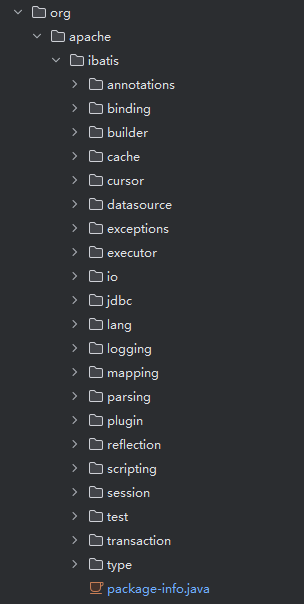
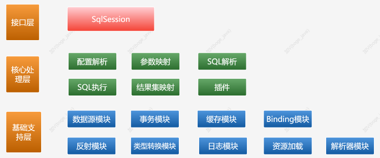
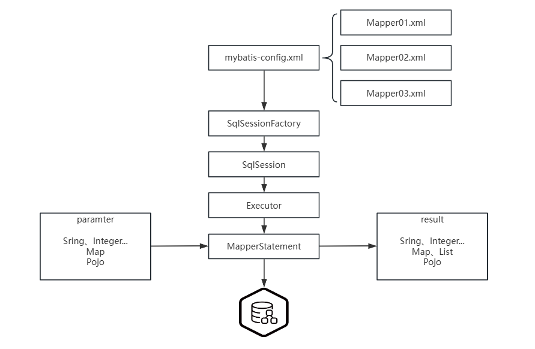

# 一、ORM框架

对象关系映射（ORM）框架的发展是现代软件开发中一个重要的进展，特别是在处理数据库和对象编程语言之间的不匹配问题（即所谓的"对象-关系不匹配"）时。从最初的简单库到今天的成熟框架，ORM技术已经在数据持久化和应用开发中扮演了核心角色。

## 1.ORM框架的发展

### （1）早期的ORM技术

ORM的概念在1990年代初开始获得关注，当时的主要问题是如何将在关系数据库中存储的数据转化为应用程序中使用的对象。最初的解决方案很大程度上依赖于手动编写代码来转换数据表中的行为对象，这一过程既繁琐又易于出错。

### （2）ORM框架的崛起

随着Java和.NET这样的平台的兴起，ORM框架开始逐渐流行。这些框架提供了自动化工具，帮助开发者减少手动处理数据库交互的工作量。例如：

- **Hibernate**：在Java社区，Hibernate成为最受欢迎的ORM框架之一。它提供了丰富的映射能力来处理复杂的关系数据，并支持延迟加载、缓存以及复杂查询功能，极大地简化了数据库操作。
- **Entity Framework**：作为.NET环境的一个回应，Entity Framework提供了一个广泛的模型来处理数据，并支持LINQ查询，使得.NET开发者能够以一种更自然的方式来处理数据库数据。
- **ActiveRecord**：在Ruby社区中，ActiveRecord作为Ruby on Rails框架的一部分，以其简单易用而著称，遵循“约定优于配置”的原则。

### （3）ORM框架的成熟与挑战

随着ORM技术的普及，开发者开始意识到它不仅仅是简化数据库编程的工具。高级功能如二级缓存、事务管理、多版本并发控制和自动迁移工具等，使得ORM框架成为企业应用中不可或缺的一部分。

然而，ORM框架也面临着一些批评和挑战，特别是在性能和复杂性管理方面：
- **性能问题**：ORM框架的抽象层可能隐藏了一些性能陷阱，如N+1查询问题、不恰当的数据抓取策略等。
- **复杂性和学习曲线**：虽然ORM框架简化了很多数据库操作，但它们自身的复杂性也要求开发者投入时间来学习如何正确使用。

## 2.JDBC

## 3.SpringJDBC

## 4.Hibernate

## 5.MyBatis

# 二、MyBatis核心应用

## 1.实际案例

### （1）环境准备

#### ① 导入依赖

```xml
<dependency>
    <groupId>org.mybatis</groupId>
    <artifactId>mybatis</artifactId>
    <version>3.5.4</version>
</dependency>
<dependency>
    <groupId>mysql</groupId>
    <artifactId>mysql-connector-java</artifactId>
    <version>8.0.11</version>
</dependency>
```

#### ② 实体类

```java
public class User {
    private Integer id;
    private String userName;
    private String realName;
    private String password;
    private Integer age;
    private Integer dId;
}
```

#### ③ 全局配置文件

```xml
<?xml version="1.0" encoding="UTF-8" ?>
<!DOCTYPE configuration PUBLIC "-//mybatis.org//DTD Config 3.0//EN" "http://mybatis.org/dtd/mybatis-3-config.dtd">
<configuration>

    <properties resource="db.properties"></properties>
    <settings>
        <!-- 打印查询语句 -->
        <setting name="logImpl" value="STDOUT_LOGGING" />
        <!-- 控制全局缓存（二级缓存），默认 true-->
        <setting name="cacheEnabled" value="false"/>
        <!-- 延迟加载的全局开关。当开启时，所有关联对象都会延迟加载。默认 false  -->
        <setting name="lazyLoadingEnabled" value="true"/>
        <!-- 当开启时，任何方法的调用都会加载该对象的所有属性。默认 false，可通过select标签的 fetchType来覆盖-->
        <setting name="aggressiveLazyLoading" value="true"/>
        <!--  Mybatis 创建具有延迟加载能力的对象所用到的代理工具，默认JAVASSIST -->
        <!--<setting name="proxyFactory" value="CGLIB" />-->
        <!-- STATEMENT级别的缓存，使一级缓存，只针对当前执行的这一statement有效 -->
        <!--
                <setting name="localCacheScope" value="STATEMENT"/>
        -->
        <setting name="localCacheScope" value="SESSION"/>
    </settings>

    <typeAliases>
        <typeAlias alias="user" type="com.boge.domain.User" />
    </typeAliases>

    <environments default="development">
        <environment id="development">
            <transactionManager type="JDBC"/><!-- 单独使用时配置成MANAGED没有事务 -->
            <dataSource type="POOLED">
                <property name="driver" value="${jdbc.driver}"/>
                <property name="url" value="${jdbc.url}"/>
                <property name="username" value="${jdbc.username}"/>
                <property name="password" value="${jdbc.password}"/>
            </dataSource>
        </environment>
    </environments>

    <mappers>
        <mapper resource="mapper/UserMapper.xml"/>
    </mappers>

</configuration>
```

#### ④ 映射文件

```xml
<?xml version="1.0" encoding="UTF-8"?>
<!DOCTYPE mapper PUBLIC "-//mybatis.org//DTD Mapper 3.0//EN" "http://mybatis.org/dtd/mybatis-3-mapper.dtd">
<mapper namespace="com.boge.mapper.UserMapper">
  <resultMap id="BaseResultMap" type="user">
    <id property="id" column="id" jdbcType="INTEGER"/>
    <result property="userName" column="user_name" jdbcType="VARCHAR" />
    <result property="realName" column="real_name" jdbcType="VARCHAR" />
    <result property="password" column="password" jdbcType="VARCHAR"/>
    <result property="age" column="age" jdbcType="INTEGER"/>
    <result property="dId" column="d_id" jdbcType="INTEGER"/>
  </resultMap>

  <select id="selectUserById" resultMap="BaseResultMap" statementType="PREPARED" >
        select * from t_user where id = #{id}
    </select>

  <!-- $只能用在自定义类型和map上 -->
  <select id="selectUserByBean"  parameterType="user" resultMap="BaseResultMap" >
        select * from t_user where user_name = '${userName}'
    </select>

  <select id="selectUserList" resultMap="BaseResultMap" >
        select * from t_user
    </select>
</mapper>
```

#### ⑤ 数据库属性文件

```properties
jdbc.driver=com.mysql.jdbc.Driver
jdbc.url=jdbc:mysql://localhost:3306/mybatisdb?characterEncoding=utf-8&serverTimezone=UTC
jdbc.username=root
jdbc.password=123456
```

### （2）传统开发

```java
@Test
public void test1() throws  Exception{
    // 1.获取配置文件
    InputStream in = Resources.getResourceAsStream("mybatis-config.xml");
    // 2.加载解析配置文件并获取SqlSessionFactory对象
    SqlSessionFactory factory = new SqlSessionFactoryBuilder().build(in);
    // 3.根据SqlSessionFactory对象获取SqlSession对象
    SqlSession sqlSession = factory.openSession();
    // 4.通过SqlSession中提供的 API方法来操作数据库
    List<User> list = sqlSession.selectList("com.boge.mapper.UserMapper.selectUserList");
    for (User user : list) {
        System.out.println(user);
    }
    // 5.关闭会话
    sqlSession.close();
}
```

### （3）代理模式开发

#### ① 接口声明

```java
public interface UserMapper {
    public List<User> selectUserList();
}
```

#### ② getMapper

```java
@Test
public void test2() throws Exception{
    // 1.获取配置文件
    InputStream in = Resources.getResourceAsStream("mybatis-config.xml");
    // 2.加载解析配置文件并获取SqlSessionFactory对象
    SqlSessionFactory factory = new SqlSessionFactoryBuilder().build(in);
    // 3.根据SqlSessionFactory对象获取SqlSession对象
    SqlSession sqlSession = factory.openSession();
    // 4.通过SqlSession中提供的 API方法来操作数据库
    UserMapper mapper = sqlSession.getMapper(UserMapper.class);
    List<User> list = mapper.selectUserList();
    for (User user : list) {
        System.out.println(user);
    }
    // 5.关闭会话
    sqlSession.close();
}
```

## 2.核心配置

### （1）全局配置文件

全局配置文件子元素结构如下：

- configuration（配置）
- properties（属性）
- settings（设置）
- typeAliases（类型别名）
- typeHandlers（类型处理器）
- objectFactory（对象工厂）
- plugins（插件）
- environments（环境配置）
  - environment（环境变量）
    - transactionManager（事务管理器）
    - dataSource（数据源）
- databaseIdProvider（数据库厂商标识）
- mappers（映射器）

#### ① configuration

这是配置文件的根节点，所有的配置项都包含在这里。

#### ② properties 

这部分用于定义外部配置文件的路径，或直接在此配置一些属性。可以在配置文件的其他部分通过 `${propertyName}` 的方式引用这里定义的属性值。

```xml
<properties resource="database.properties">
    <property name="username" value="root"/>
    <property name="password" value="secret"/>
</properties>
```

#### ③ settings

影响 MyBatis 全局行为的细粒度设置，例如缓存、懒加载等。

| 设置参数                         | 描述                                                                                                                                                                                                                                                     | 有效值                                           | 默认值                                                |
| -------------------------------- | :------------------------------------------------------------------------------------------------------------------------------------------------------------------------------------------------------------------------------------------------------- | :----------------------------------------------- | :---------------------------------------------------- |
| cacheEnabled                     | 全局地开启或关闭配置文件中的所有映射器已经配置的任何缓存。                                                                                                                                                                                               | true                                             | false                                                 |
| lazyLoadingEnabled               | 延迟加载的全局开关。当开启时，所有关联对象都会延迟加载。 特定关联关系中可通过设置fetchType属性来覆盖该项的开关状态。                                                                                                                                     | true                                             | false                                                 |
| aggressiveLazyLoading            | 当开启时，任何方法的调用都会加载该对象的所有属性。否则，每个属性会按需加载（参考lazyLoadTriggerMethods).                                                                                                                                                 | true                                             | false                                                 |
| multipleResultSetsEnabled        | 是否允许单一语句返回多结果集（需要兼容驱动）。                                                                                                                                                                                                           | true                                             | false                                                 |
| useColumnLabel                   | 使用列标签代替列名。不同的驱动在这方面会有不同的表现， 具体可参考相关驱动文档或通过测试这两种不同的模式来观察所用驱动的结果。                                                                                                                            | true                                             | false                                                 |
| useGeneratedKeys                 | 允许 JDBC 支持自动生成主键，需要驱动兼容。 如果设置为 true 则这个设置强制使用自动生成主键，尽管一些驱动不能兼容但仍可正常工作（比如 Derby）。                                                                                                            | true                                             | false                                                 |
| autoMappingBehavior              | 指定 MyBatis 应如何自动映射列到字段或属性。 NONE 表示取消自动映射；PARTIAL 只会自动映射没有定义嵌套结果集映射的结果集。 FULL 会自动映射任意复杂的结果集（无论是否嵌套）。                                                                                | NONE, PARTIAL, FULL                              | PARTIAL                                               |
| autoMappingUnknownColumnBehavior | 指定发现自动映射目标未知列（或者未知属性类型）的行为。 NONE: 不做任何反应WARNING: 输出提醒日志('org.apache.ibatis.session.AutoMappingUnknownColumnBehavior' 的日志等级必须设置为 WARN) FAILING: 映射失败 (抛出 SqlSessionException)                      | NONE, WARNING, FAILING                           | NONE                                                  |
| defaultExecutorType              | 配置默认的执行器。SIMPLE 就是普通的执行器；REUSE 执行器会重用预处理语句（prepared statements）； BATCH 执行器将重用语句并执行批量更新。                                                                                                                  | SIMPLE REUSE BATCH                               | SIMPLE                                                |
| defaultStatementTimeout          | 设置超时时间，它决定驱动等待数据库响应的秒数。                                                                                                                                                                                                           | 任意正整数                                       | Not Set (null)                                        |
| defaultFetchSize                 | 为驱动的结果集获取数量（fetchSize）设置一个提示值。此参数只可以在查询设置中被覆盖。                                                                                                                                                                      | 任意正整数                                       | Not Set (null)                                        |
| safeRowBoundsEnabled             | 允许在嵌套语句中使用分页（RowBounds）。如果允许使用则设置为false。                                                                                                                                                                                       | true                                             | false                                                 |
| safeResultHandlerEnabled         | 允许在嵌套语句中使用分页（ResultHandler）。如果允许使用则设置为false。                                                                                                                                                                                   | true                                             | false                                                 |
| mapUnderscoreToCamelCase         | 是否开启自动驼峰命名规则（camel case）映射，即从经典数据库列名 A_COLUMN 到经典 Java 属性名 aColumn 的类似映射。                                                                                                                                          | true\| false                                     | False                                                 |
| localCacheScope                  | MyBatis 利用本地缓存机制（Local Cache）防止循环引用（circular references）和加速重复嵌套查询。 默认值为 SESSION，这种情况下会缓存一个会话中执行的所有查询。 若设置值为 STATEMENT，本地会话仅用在语句执行上，对相同 SqlSession 的不同调用将不会共享数据。 | SESSION\| STATEMENT                              | SESSION                                               |
| jdbcTypeForNull                  | 当没有为参数提供特定的 JDBC 类型时，为空值指定 JDBC 类型。 某些驱动需要指定列的 JDBC 类型，多数情况直接用一般类型即可，比如 NULL、VARCHAR 或 OTHER。                                                                                                     | JdbcType 常量. 大多都为: NULL, VARCHAR and OTHER | OTHER                                                 |
| lazyLoadTriggerMethods           | 指定哪个对象的方法触发一次延迟加载。                                                                                                                                                                                                                     | 用逗号分隔的方法列表。                           | equals,clone,hashCode,toString                        |
| defaultScriptingLanguage         | 指定动态 SQL 生成的默认语言。                                                                                                                                                                                                                            | 一个类型别名或完全限定类名。                     | org.apache.ibatis.scripting.xmltags.XMLLanguageDriver |
| defaultEnumTypeHandler           | 指定 Enum 使用的默认 TypeHandler 。 (从3.4.5开始) 	一个类型别名或完全限定类名。                                                                                                                                                                          | org.apache.ibatis.type.EnumTypeHandler           |                                                       |
| callSettersOnNulls               | 指定当结果集中值为 null 的时候是否调用映射对象的 setter（map 对象时为 put）方法，这对于有 Map.keySet() 依赖或 null 值初始化的时候是有用的。注意基本类型（int、boolean等）是不能设置成 null 的。                                                          | true\| false                                     | false                                                 |
| returnInstanceForEmptyRow        | 当返回行的所有列都是空时，MyBatis默认返回null。 当开启这个设置时，MyBatis会返回一个空实例。 请注意，它也适用于嵌套的结果集 (i.e. collectioin and association)。（从3.4.2开始）                                                                           | true\| false                                     | false                                                 |
| logPrefix                        | 指定 MyBatis 增加到日志名称的前缀。                                                                                                                                                                                                                      | 任何字符串                                       | Not set                                               |
| logImpl                          | 指定 MyBatis 所用日志的具体实现，未指定时将自动查找。                                                                                                                                                                                                    | SLF4J                                            | LOG4J\| LOG4J2 \| JDK_LOGGING \| COMMONS_LOGGING\     |
| proxyFactory                     | 指定 Mybatis 创建具有延迟加载能力的对象所用到的代理工具。                                                                                                                                                                                                | CGLIB\                                           | JAVASSIST                                             |
| vfsImpl                          | 指定VFS的实现                                                                                                                                                                                                                                            | 自定义VFS的实现的类全限定名，以逗号分隔。        | Not set                                               |
| useActualParamName               | 允许使用方法签名中的名称作为语句参数名称。 为了使用该特性，你的工程必须采用Java 8编译，并且加上-parameters选项。（从3.4.1开始）                                                                                                                          | true\| false                                     | true                                                  |
| configurationFactory             | 指定一个提供Configuration实例的类。 这个被返回的Configuration实例用来加载被反序列化对象的懒加载属性值。 这个类必须包含一个签名方法static Configuration getConfiguration(). (从 3.2.3 版本开始)                                                           | 类型别名或者全类名.                              | Not set                                               |

####  ④ typeAliases

为 Java 类型设置一个短的名字，可以在 XML 映射文件中使用。并且预先定义好了很多类型别名，具体在`org.apache.ibatis.type.TypeAliasRegistry`类中，这也是可以使用基本类型别名的原因。

####  ⑤ typeHandlers

指定不同类型之间的转换规则，例如 Java 类型与数据库类型的转换,通过实现`TypeHandler`或继承`BaseTypeHandler`，实现自定义类型处理器。

```xml
<typeHandlers>
    <typeHandler handler="com.example.MyTypeHandler"/>
</typeHandlers>
```

#### ⑥ objectFactory

通过实现 `ObjectFactory` 或继承`DefaultObjectFactory`，可以自定义对象创建的过程。

```xml
<objectFactory type="com.example.MyObjectFactory"/>
```

####  ⑦ plugins

允许你插入自定义行为到 MyBatis 操作数据库的过程中，例如：拦截器。

```xml
<plugins>
    <plugin interceptor="com.example.MyPlugin">
        <property name="someProperty" value="100"/>
    </plugin>
</plugins>
```

#### ⑧ environments

配置不同环境下的数据库连接，可以定义多个环境。

```xml
<environments default="development">
    <environment id="development">
        <!--事务管理器-->
        <transactionManager type="JDBC"/>
        <!--数据源-->
        <dataSource type="POOLED">
            <property name="driver" value="com.mysql.jdbc.Driver"/>
            <property name="url" value="jdbc:mysql://localhost/mybatis"/>
            <property name="username" value="${username}"/>
            <property name="password" value="${password}"/>
        </dataSource>
    </environment>
</environments>
```

#### ⑨ mappers

指定 SQL 映射文件的位置，这些文件包含 SQL 语句和映射定义。

### （2）SQL 映射文件

SQL 映射文件子元素结构如下：

- `cache` – 该命名空间的缓存配置。
- `cache-ref` – 引用其它命名空间的缓存配置。
- `resultMap` – 描述如何从数据库结果集中加载对象，是最复杂也是最强大的元素。
- `parameterMap` – 老式风格的参数映射。此元素已被废弃，并可能在将来被移除！请使用行内参数映射。文档中不会介绍此元素。
- `sql` – 可被其它语句引用的可重用语句块。
- `insert` – 映射插入语句。
- `update` – 映射更新语句。
- `delete` – 映射删除语句。
- `select` – 映射查询语句。

#### ① **`cache`**
为当前命名空间配置缓存，提高查询效率，开启二级缓存。

```xml
<cache eviction="FIFO" flushInterval="60000" size="512" readOnly="true"/>
```

#### ② **`cache-ref`**
引用另一个命名空间的缓存配置，实现缓存共享。

```xml
<cache-ref namespace="com.example.otherMapper"/>
```

#### ③ **`resultMap`**
详细描述如何从数据库结果集映射到 Java 对象，支持复杂的数据结构。

```xml
<resultMap id="userResultMap" type="User">
  <id property="id" column="user_id" />
  <result property="username" column="username" />
  <association property="address" column="address_id" javaType="Address">
    <id property="id" column="address_id" />
    <result property="street" column="street" />
  </association>
</resultMap>
```

#### ④ **`sql`**
定义可重用的 SQL 代码片段，减少代码重复。

```xml
<sql id="userColumns">user_id, username, password, email</sql>
```

#### ⑤ **`insert`**
映射插入操作，可返回自动生成的键值。

```xml
<insert id="insertUser" useGeneratedKeys="true" keyProperty="id">
  INSERT INTO users (username, password, email) VALUES (#{username}, #{password}, #{email})
</insert>
```

#### ⑥ **`update`**
映射更新操作，支持动态 SQL。

```xml
<update id="updateUser">
  UPDATE users SET username = #{username}, password = #{password} WHERE id = #{id}
</update>
```

#### ⑦ **`delete`**
映射删除操作。

```xml
<delete id="deleteUser">
  DELETE FROM users WHERE id = #{id}
</delete>
```

#### ⑧ **`select`**
映射查询操作，可用于复杂的结果映射。

```xml
<select id="findUserById" resultMap="userResultMap">
  SELECT * FROM users WHERE id = #{id}
</select>
```

`select`属性如下：

| 属性            | 描述                                                         |
| :-------------- | :----------------------------------------------------------- |
| `id`            | 在命名空间中唯一的标识符，可以被用来引用这条语句。           |
| `parameterType` | 将会传入这条语句的参数的类全限定名或别名。这个属性是可选的，因为 MyBatis 可以通过类型处理器（TypeHandler）推断出具体传入语句的参数，默认值为未设置（unset）。 |
| `parameterMap`  | 用于引用外部 parameterMap 的属性，目前已被废弃。请使用行内参数映射和 parameterType 属性。 |
| `resultType`    | 期望从这条语句中返回结果的类全限定名或别名。 注意，如果返回的是集合，那应该设置为集合包含的类型，而不是集合本身的类型。 resultType 和 resultMap 之间只能同时使用一个。 |
| `resultMap`     | 对外部 resultMap 的命名引用。结果映射是 MyBatis 最强大的特性，如果你对其理解透彻，许多复杂的映射问题都能迎刃而解。 resultType 和 resultMap 之间只能同时使用一个。 |
| `flushCache`    | 将其设置为 true 后，只要语句被调用，都会导致本地缓存和二级缓存被清空，默认值：false。 |
| `useCache`      | 将其设置为 true 后，将会导致本条语句的结果被二级缓存缓存起来，默认值：对 select 元素为 true。 |
| `timeout`       | 这个设置是在抛出异常之前，驱动程序等待数据库返回请求结果的秒数。默认值为未设置（unset）（依赖数据库驱动）。 |
| `fetchSize`     | 这是一个给驱动的建议值，尝试让驱动程序每次批量返回的结果行数等于这个设置值。 默认值为未设置（unset）（依赖驱动）。 |
| `statementType` | 可选 STATEMENT，PREPARED 或 CALLABLE。这会让 MyBatis 分别使用 Statement，PreparedStatement 或 CallableStatement，默认值：PREPARED。 |
| `resultSetType` | FORWARD_ONLY，SCROLL_SENSITIVE, SCROLL_INSENSITIVE 或 DEFAULT（等价于 unset） 中的一个，默认值为 unset （依赖数据库驱动）。 |
| `databaseId`    | 如果配置了数据库厂商标识（databaseIdProvider），MyBatis 会加载所有不带 databaseId 或匹配当前 databaseId 的语句；如果带和不带的语句都有，则不带的会被忽略。 |
| `resultOrdered` | 这个设置仅针对嵌套结果 select 语句：如果为 true，将会假设包含了嵌套结果集或是分组，当返回一个主结果行时，就不会产生对前面结果集的引用。 这就使得在获取嵌套结果集的时候不至于内存不够用。默认值：`false`。 |
| `resultSets`    | 这个设置仅适用于多结果集的情况。它将列出语句执行后返回的结果集并赋予每个结果集一个名称，多个名称之间以逗号分隔。 |

## 3.高级应用

### （1）动态SQL

在 MyBatis 中，动态 SQL 是非常强大的功能，它允许构建灵活的 SQL 语句以应对不同的数据操作需求

- `if`
- `choose `
- `trim `
- `foreach`

#### ① **`if`**
`if` 元素用于在 SQL 语句中加入条件判断。根据条件是否满足，可以决定是否包含某部分 SQL 代码。这在需要根据不同的输入构建查询条件时特别有用。

**示例**：
在查询用户信息时，可以根据 `username` 是否提供来动态构建 WHERE 子句：

```xml
<select id="findUserByUsername" resultType="User">
    SELECT * FROM users
    <where>
        <if test="username != null and username != ''">
            username = #{username}
        </if>
    </where>
</select>
```

#### ② **`choose`**
`choose` 元素类似于 Java 中的 `switch` 语句，它允许从多个选项中选择一个来执行。结合 `when` 和 `otherwise` 子元素，可以根据条件选择性地构建 SQL 语句的一部分。

**示例**：
在查询订单时，可以根据不同的状态代码来动态调整查询条件：
```xml
<select id="findOrder" resultType="Order">
    SELECT * FROM orders
    <where>
        <choose>
            <when test="state == 'NEW'">
                state = 'NEW'
            </when>
            <when test="state == 'PENDING'">
                state = 'PENDING'
            </when>
            <otherwise>
                state = 'CLOSED'
            </otherwise>
        </choose>
    </where>
</select>
```

#### ③ **`trim`**
`trim` 元素用于动态添加或删除 SQL 语句的前缀、后缀或同时处理前后缀。这非常有用，尤其是在处理动态 `INSERT` 或 `UPDATE` 语句时，用于添加或移除逗号。

**示例**：
动态构建 UPDATE 语句，根据提供的参数决定更新哪些字段：

```xml
<update id="updateUser" parameterType="User">
    UPDATE users
    <set>
        <trim suffixOverrides=",">
            <if test="username != null">username = #{username},</if>
            <if test="email != null">email = #{email},</if>
        </trim>
    </set>
    WHERE id = #{id}
</update>
```

#### ④ **`foreach`**
`foreach` 元素用于遍历集合，并对每个元素执行 SQL 语句片段，常用于实现 IN 查询、批量插入和更新操作。

**示例**：
使用 IN 语句查询多个用户 ID：

```xml
<select id="findUsersByIds" resultType="User">
    SELECT * FROM users
    WHERE id IN
    <foreach item="id" collection="list" open="(" separator="," close=")">
        #{id}
    </foreach>
</select>
```

### （2）批量操作

### （3）关联查询

### （4）分页

### （5）MBG

### （6）通用Mapper

### （7）MyBatis-Plus

# 三、MyBatis核心工作原理

## 1.源码环境

> github仓库源码（注释）地址：https://github.com/AngryYYyyyy/study-note.git

将源码打包到本地仓库，并关联源码，这样就可以进行注释了。



## 2.三层划分



### （1）接口层

接口层是开发者与MyBatis交互最频繁的层面，主要涉及以下几个关键组件和功能：

- **`SqlSession`**：这是一个面向用户的接口，封装了对数据库操作的所有方法。它的实现类负责管理SQL命令的执行、事务的处理和对结果集的处理。
- **`Mapper`**：开发者定义的接口，通过XML或注解与SQL语句绑定。MyBatis使用动态代理技术来透明地将这些接口方法调用转换为数据库操作。

### 1.2 核心处理层



核心处理层是MyBatis的执行引擎，负责处理所有SQL操作的细节。主要功能包括：

1. **配置解析**：将全文配置文件、Mapper配置文件进行解析，生成访问入口。
2. **参数映射**：将方法调用中的参数转换为JDBC可以接受的形式，包括基本类型、Map或POJO。
3. **SQL解析**：解析映射文件中定义的SQL语句，实现包括条件判断、循环等动态SQL功能。
4. **SQL执行**：使用JDBC API执行SQL语句，这包括创建`PreparedStatement`，设置参数，执行查询或更新。
5. **结果映射**：将JDBC返回的`ResultSet`转换为Java对象，可以是简单的JavaBean、集合或复杂的嵌套对象。

此外，插件（如分页插件、权限插件等）也在这一层实现，通常通过拦截器（Interceptor）方式集成，以增强或修改SQL执行流程。

### 1.3 基础支持层

基础支持层提供了底层的、通用的技术支持和服务，这些功能确保核心层可以高效、稳定地运行。包括：

- **数据源管理**：管理数据库连接，包括连接的配置、获取、释放等。
- **事务管理**：处理事务的开启、提交和回滚。
- **缓存管理**：提供一级缓存和二级缓存支持，减少数据库访问次数，提高性能。
- **日志管理**：集成日志框架，方便跟踪执行过程和调试。
- **XML解析**：解析映射文件，将XML配置转化为内部配置对象。
- **反射、IO和其他工具**：提供反射机制操作对象，文件IO处理等。

这些组件确保MyBatis能够作为一个健壮的框架运行，在各种应用环境下提供稳定的数据访问服务。

## 3.核心对象

### （1）描述

#### ① Configuration
**Configuration** 对象是 MyBatis 中的配置中心，包含了所有的配置信息。

这包括如何设置数据源（DataSource）、事务管理器（TransactionManager）、映射文件（Mapper XML files）等。其中 **MapperRegistry** 负责维护所有 Mapper 接口与其对应代理对象的关系；**TypeAliasRegistry** 用于管理类名与别名之间的对应关系，简化 XML 配置文件；**TypeHandlerRegistry** 管理 Java 类型与数据库类型之间的映射和转换。

#### ② SqlSession
**SqlSession** 提供了执行 SQL 命令、获取 Mapper 和管理事务的接口。它是应用程序与数据库交互的直接接口。通过 **SqlSessionFactory** 创建，主要实现类是 **DefaultSqlSession**，封装了数据库操作的所有方法，如查询、插入、更新和删除。

#### ③ Executor
**Executor** 是 MyBatis 的核心组件之一，负责 SQL 的生成和执行，以及事务的管理。

它有几种具体实现：

- **SimpleExecutor** 每次操作都创建一个新的 Statement。
- **ReuseExecutor** 重用 Statements。
- **BatchExecutor** 执行批量更新。
- **BaseExecutor** ：提供了缓存管理和延迟加载的基础功能。

#### ④ StatementHandler
**StatementHandler** 封装了 JDBC Statement 的使用，负责 SQL 语句的实际执行过程。

**SimpleStatementHandler**、**PreparedStatementHandler** 和 **CallableStatementHandler**，分别用于处理不同类型的 Statements。它们的主要职责是设置 SQL 语句的参数、执行 SQL 语句和处理返回的结果集。

#### ⑤ ParameterHandler
**ParameterHandler** 主要负责将用户传递的参数转换成 JDBC 接口所需的格式。

默认实现为 **DefaultParameterHandler**，这个处理器解析方法参数与 SQL 参数之间的映射关系，并设置到 PreparedStatement 中。

#### ⑥ ResultSetHandler
**ResultSetHandler** 的职责是将 JDBC 返回的 ResultSet 结果集转换成 Java 对象。通常情况下，这涉及复杂的类型映射和数据转换。默认的实现是 **DefaultResultSetHandler**，它处理结果集的映射到返回的对象或对象集合。

#### ⑦ MapperProxy
**MapperProxy** 通过 **MapperProxyFactory** 生成 Mapper 接口的代理对象，代理对象将接口方法的调用转换为执行相应的 SQL 命令。这种方式允许动态地将接口方法与 SQL 语句关联起来，无需手动编写数据访问代码。

#### ⑧ MappedStatement
**MappedStatement** 维护了一条 `<select|update|delete|insert>` 节点的详细信息，这是 SQL 映射的核心，包含 SQL 语句、输入参数和输出结果的映射信息。它通过 **SqlSource** 和 **BoundSql** 来生成最终执行的 SQL 代码，**SqlSource** 负责根据传入参数解析 SQL 语句模板，生成可执行的 SQL。


### （2）生命周期

## 4.`SqlSessionFactory`

## 5.`SqlSession`

## 6.`Mapper`

## 7.`SQL`执行


