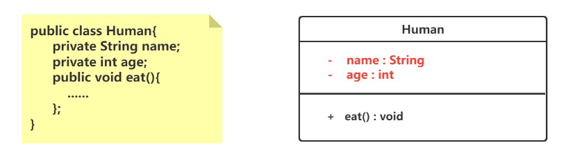
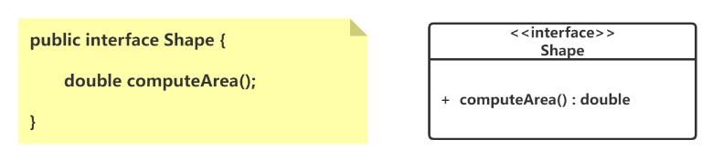
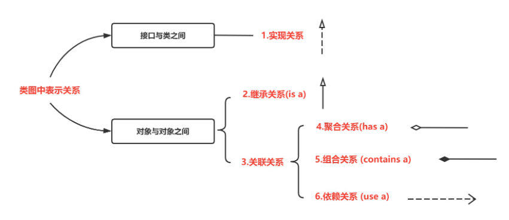
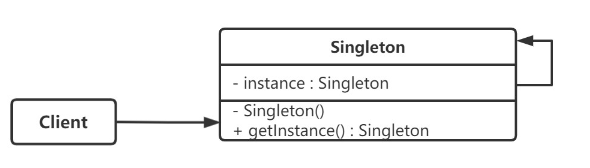
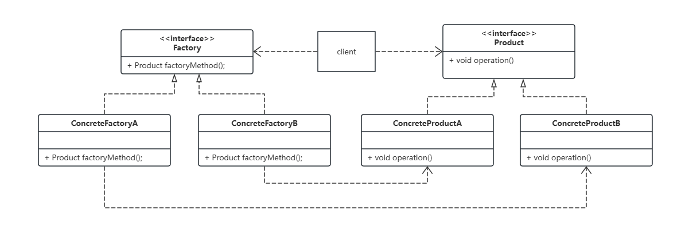
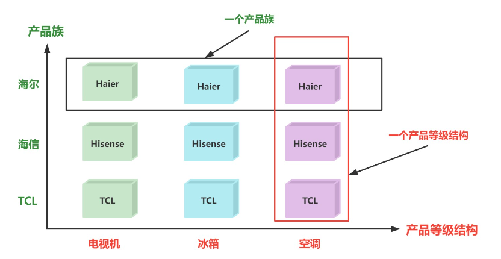
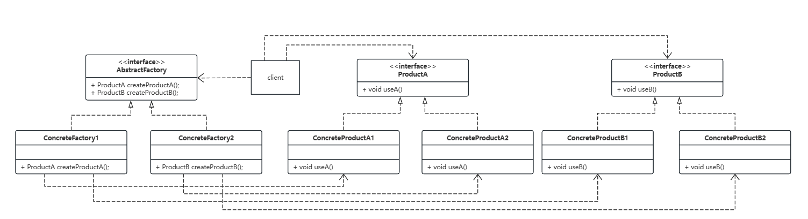
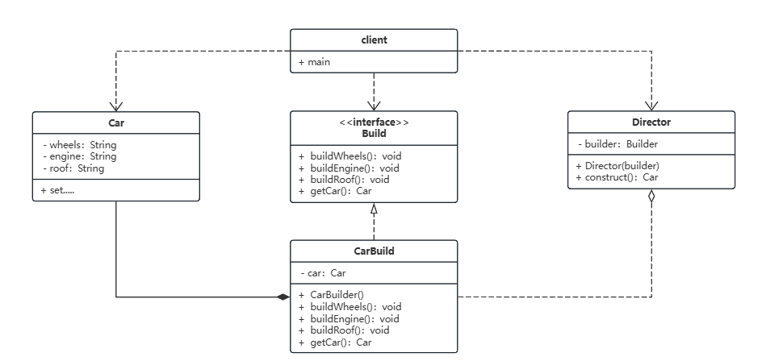

# 一、UML图

类图（Class Diagram）是统一建模语言（UML, Unified Modeling Language）中的一种图形，用于展示系统中的类、类之间的关系以及类的内部结构。它是面向对象分析和设计过程中最常用的图形之一。类图不仅有助于软件开发过程中的设计和文档化，也有助于团队成员之间的沟通。

## 1.类



### （1）矩形框

- **顶部**：显示类的名称，如果是抽象类，则名称是斜体。
- **中部**：显示类的属性或成员变量。
- **底部**：显示类的方法或成员函数。

### （2）修饰符

- “+” 表示 `public`；
- “-” 表示 `private`；
- “#” 表示 `protected`；
- 不带符号表示 `default`。

## 2.接口

接口在类图中也是用矩形框表示，但是与类的表示法不同的是，接口在类图中的第一层顶端用构造型 <<interface>>表示，下面是接口的名字，第二层是方法。



## 3.关系表示



# 二、创建型模式

## 1.单例模式

### （1）概述

单例模式保证某个类在运行期间，只有一个实例，并为该实例提供一个全局访问节点，而这个类被称为单例类。



### （2）饿汉模式

饿汉式单例模式是一种在类加载时就完成实例化并初始化好静态实例的方法，以确保实例的唯一性和线程安全。这种方法利用了Java类加载机制，确保实例只被创建一次。

**实现：**

```java
public class Singleton {
    // 在类加载时就初始化一个静态私有实例
    private static final Singleton instance = new Singleton();

    // 私有构造函数，防止外部创建实例
    private Singleton() {}

    // 提供一个公共的静态方法，返回唯一实例
    public static Singleton getInstance() {
        return instance;
    }
}

```

**特点**

- **线程安全**：由于单例的唯一实例是在类加载时创建的，这一过程由JVM执行，因此不会出现线程安全问题。
- **无延迟加载**：实例在类加载时就已创建，因此不存在延迟加载的选项。这样做的好处是避免了调用 `getInstance()` 方法时的任何类型的同步延迟，但是也可能导致资源利用率降低。
- **资源消耗**：如果实例创建过程中涉及重资源分配，或实例占用明显的内存空间，且该实例的使用频率并不高，那么这种模式可能导致资源的浪费。

### （3）懒汉模式（DCL）

双重校验锁模式（Double-Check Locking）是懒汉模式的一个改进版本，用于减少获取对象的成本和提高性能，同时保持线程安全。这种方式首先检查实例是否已经创建，如果尚未创建，才进行同步。这种方法可以大大减少 `getInstance()` 的时间消耗。

**实现：**

```java
public class LazySingleton {
    // 使用 volatile 关键字保证可见性和禁止指令重排序
    private static volatile LazySingleton instance;

    // 私有构造函数，防止外部实例化
    private LazySingleton() {}

    // 公共的获取实例方法，实现双重校验锁
    public static LazySingleton getInstance() {
        if (instance == null) { // 第一次检查：避免不必要的同步
            synchronized (LazySingleton.class) { // 同步
                if (instance == null) { // 第二次检查：在null的情况下创建实例
                    instance = new LazySingleton();
                }
            }
        }
        return instance;
    }
}

```

**特点**

- **线程安全**：通过同步代码块减少了同步的开销，只在第一次创建实例时才同步，提高了效率。
- **延迟加载**：实例在首次使用时创建，优化了资源的使用。
- **资源优化**：避免了在应用启动时就创建对象，减轻了启动负担。

**注意事项**

- **volatile 关键字**：`instance` 需要被声明为 `volatile`，这样可以防止 JVM 的指令重排，确保在对象被初始化之后才将引用指向内存空间，从而保证线程安全。
- **性能考虑**：虽然双重校验锁比普通锁性能更好，但在极高并发的情况下仍然会有性能瓶颈。

## 2.工厂方法模式

工厂方法模式是一种创建型设计模式，它定义了一个创建对象的接口，但将实际的对象创建工作推迟到实现类中完成。这样的设计模式让类的实例化操作延迟到其实现类，通过这种方式，工厂方法模式解决了接口选择的问题，使一个类不需要知道它所创建的对象的具体类。

### （1）组成

- **抽象产品（Product）**:定义了产品的接口，是工厂方法创建的对象所必须遵守的模型。抽象产品可以是一个接口或抽象类，由具体产品类实现或继承。
- **具体产品（Concrete Product）**:实现或继承抽象产品的具体类。每一个具体产品类都对应一个特定的实际产品。
- **抽象工厂（Factory）**:声明工厂方法，该方法返回一个抽象产品。创建者通常是一个接口，包含调用工厂方法以返回产品对象的代码。
- **具体工厂（Concrete Factory）**:实现抽象工厂中定义的工厂方法，返回一个具体产品实例。具体工厂决定如何创建产品，以及要创建哪些产品。

### （2）类图结构



### （3）示例

```java
// 抽象产品
public interface Product {
    void operate();
}

// 具体产品A
public class ConcreteProductA implements Product {
    @Override
    public void operate() {
        System.out.println("ConcreteProductA operating.");
    }
}

// 具体产品B
public class ConcreteProductB implements Product {
    @Override
    public void operate() {
        System.out.println("ConcreteProductB operating.");
    }
}

// 抽象工厂
public interface  Factory {
    // 声明工厂方法
    Product factoryMethod();
}

// 具体工厂A
public class ConcreteFactoryA implements Factory {
    @Override
    public Product factoryMethod() {
        return new ConcreteProductA();
    }
}

// 具体工厂B
public class ConcreteFactoryB implements Factory {
    @Override
    public Product factoryMethod() {
        return new ConcreteProductB();
    }
}

```


## 3.抽象工厂模式

抽象工厂模式是一种创建型设计模式，用于处理具有相同（或相似）主题的产品族而无需指定具体类的情况。这个模式提供了一个接口，用来创建一系列相关或相互依赖的对象，而不需要指定它们具体的类。

### （1）产品等级结构与产品族

- **产品等级结构** ：产品等级结构即产品的继承结构，如一个抽象类是电视机，其子类有海尔电视机、海信电视机、TCL电视机，则抽象电视机与具体品牌的电视机之间构成了一个产品等级结构，抽象电视机是父类，而具体品牌的电视机是其子类。

- **产品族** ：在抽象工厂模式中，产品族是指由同一个工厂生产的，位于不同产品等级结构中的一组产品，如海尔电器工厂生产的海尔电视机、海尔电冰箱，海尔电视机位于电视机产品等级结构中，海尔电冰箱位于电冰箱产品等级结构中。



### （2）组成

- **抽象工厂（Abstract Factory）**:提供一个创建一系列相关或相互依赖对象的接口，而无需指定它们具体的类。
- **具体工厂（Concrete Factory）**:实现抽象工厂的操作，生成具体的产品。
- **抽象产品（Abstract Product）**:为一类产品对象声明一个接口。
- **具体产品（Concrete Product）**:抽象产品的具体实现。这些定义了具体工厂生产的具体产品对象，实现抽象产品定义的接口。

### （3）类图结构



### （4）示例

```java
// 抽象产品A
public interface ProductA {
    void useA();
}

// 抽象产品B
public interface ProductB {
    void useB();
}

// 具体产品A1
public class ProductA1 implements ProductA {
    @Override
    public void useA() {
        System.out.println("Using Product A1");
    }
}

// 具体产品B1
public class ProductB1 implements ProductB {
    @Override
    public void useB() {
        System.out.println("Using Product B1");
    }
}

// 具体产品A2
public class ProductA2 implements ProductA {
    @Override
    public void useA() {
        System.out.println("Using Product A2");
    }
}

// 具体产品B2
public class ProductB2 implements ProductB {
    @Override
    public void useB() {
        System.out.println("Using Product B2");
    }
}

// 抽象工厂
public interface AbstractFactory {
    ProductA createProductA();
    ProductB createProductB();
}

// 具体工厂1
public class ConcreteFactory1 implements AbstractFactory {
    @Override
    public ProductA createProductA() {
        return new ProductA1();
    }

    @Override
    public ProductB createProductB() {
        return new ProductB1();
    }
}

// 具体工厂2
public class ConcreteFactory2 implements AbstractFactory {
    @Override
    public ProductA createProductA() {
        return new ProductA2();
    }

    @Override
    public ProductB createProductB() {
        return new ProductB2();
    }
}

// 客户端代码
public class Client {
    private ProductA productA;
    private ProductB productB;

    public Client(AbstractFactory factory) {
        productA = factory.createProductA();
        productB = factory.createProductB();
    }

    public void useProducts() {
        productA.useA();
        productB.useB();
    }
}

```


## 4.建造者模式

建造者模式是一种创建型设计模式，它提供了一种创建复杂对象的最佳方式。该模式允许你将一个复杂对象的构建过程从其表示中分离出来，使得同样的构建过程可以创建不同的表示。这种模式通常用于设计一个复杂对象的组成部分和它的装配方式。

### （1）组成：

1. **产品（Product）**:最终要构建的复杂对象。
2. **建造者（Builder）**:抽象接口，定义创建产品对象的各个部件的接口。
3. **具体建造者（Concrete Builder）**:实现 Builder 接口，提供完成构建最终产品实例的方法和过程。每个具体建造者都负责创建特定产品的实例。
4. **指挥者（Director）**:负责安排已有模块的构建步骤，对外提供简化的接口。

### （2）类图结构



### （3）示例

```java
// 产品角色
class Car {
    private String wheels;
    private String engine;
    private String roof;

    public void setWheels(String wheels) { this.wheels = wheels; }
    public void setEngine(String engine) { this.engine = engine; }
    public void setRoof(String roof) { this.roof = roof; }
    public String toString() {
        return "Car with " + wheels + ", " + engine + ", " + roof;
    }
}

// 抽象建造者
interface Builder {
    void buildWheels();
    void buildEngine();
    void buildRoof();
    Car getCar();
}

// 具体建造者
class CarBuilder implements Builder {
    private Car car;

    public CarBuilder() {
        this.car = new Car();
    }

    @Override
    public void buildWheels() {
        car.setWheels("Normal wheels");
    }

    @Override
    public void buildEngine() {
        car.setEngine("Normal engine");
    }

    @Override
    public void buildRoof() {
        car.setRoof("Normal roof");
    }

    @Override
    public Car getCar() {
        return car;
    }
}

// 指挥者
class Director {
    private Builder builder;

    public Director(Builder builder) {
        this.builder = builder;
    }

    public Car construct() {
        builder.buildWheels();
        builder.buildEngine();
        builder.buildRoof();
        return builder.getCar();
    }
}

// 客户端代码
public class Client {
    public static void main(String[] args) {
        Builder builder = new CarBuilder();
        Director director = new Director(builder);
        Car car = director.construct();
        System.out.println(car);
    }
}

```


